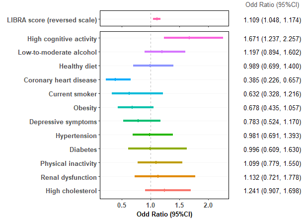

## RESEARCH PAPER 
### Title: Associations of the LIBRA index with cognitive resilience to genetic susceptibility to dementia 

This repository provides R codes used to:

(i) assign CR to genetic risk status

(ii) account for the variability in our 2-stage approach using parametric bootstraps

(iii) yield forest plots as below

Figure 2. Multivariable-adjusted associations between the baseline LIfestyle for BRAin health (LIBRA) risk score, its individual components, and the odds of cognitive resilience in ApoE-ɛ4 carriers, the Three-City Study (n=1,103). 

Estimates are derived from two separate logistic regression models considering CRgen status as the outcome and the reversed scale (i.e., higher is brain-healthier) of the continuous LIBRA risk score (Model 1) or the twelve, unweighted, binary, LIBRA components (Model 2) as predictors of interest, adjusted for sex, age at baseline, education, and study center. 95% confidence intervals were obtained based on parametric bootstraps  with 1,000 replicates. For the components’ estimates, we ordered the protective/risk factors according to the strength of the associations. 

 
